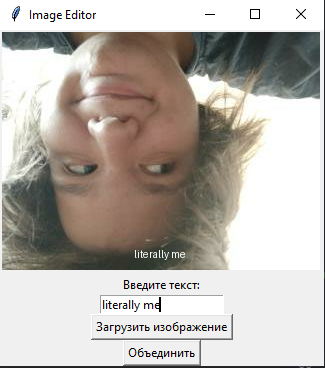

# lab11  

## Задание
       Реализуйте приложение с GUI (приложения-игры допускается делать с использованием TUI-пакетов) по своему варианту. Можно изменить задание на собственную тему, согласовав с преподавателем. Список GUI фреймворков:
        appJar
        Tkinter
        Flet
        wxPython
        PySimpleGUI
        Pyforms
        Toga
        PyGObject
        guizero
        guietta
        PySide6
        Dear PyGui
        PyGame

    Оформите README.md. Он должен содержать:
        Название вашего приложения
        Описание
        Инструкции по запуску
        Краткую справку
## Проделанная работа
Так как по условию своего варианта (`2`) мне нужно было создать генератор мемов, то свое приложение я так и назвал "Meme generator"
Моей приложение объединяет картинку которую выберет юзер с подписью который он же и придумает.
В процессе работы я столкнулся с некоторыми сложностями с редактурой текста (не смог добавить шрифт comic sans, который хотел использовать изначально, не смог добавить черную обводку у текста, а также не смог реализовать ввод текста на русском), так что советую использовать темные изображения, а текст вводить латиницей. 
Приятного мемоделания

## Скриншоты

## Список использованных источников

[лаба](https://evil-teacher.on.fleek.co/prog_pm/lab01/)
